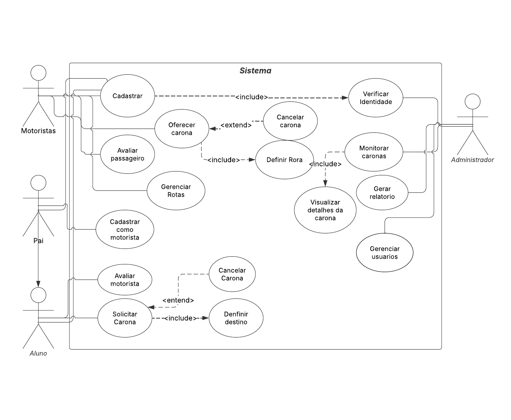

# Especificação do projeto

Pré-requisitos: <a href="01-Contexto.md"> Documentação de contexto</a>

Definição do problema e ideia de solução a partir da perspectiva do usuário. É composta pela definição do  diagrama de personas, histórias de usuários, requisitos funcionais e não funcionais além das restrições do projeto.

Apresente uma visão geral do que será abordado nesta parte do documento, enumerando as técnicas e/ou ferramentas utilizadas para realizar a especificações do projeto.

## Personas

### 1. Maria, mãe de dois alunos
Maria tem 38 anos e trabalha como enfermeira em tempo integral. Ela enfrenta dificuldades para conciliar sua rotina de trabalho com o transporte diário dos filhos para a escola. Maria busca uma solução segura e confiável que não apenas garanta a segurança das crianças, mas também ajude a economizar tempo e dinheiro. Suas principais necessidades incluem garantir que seus filhos cheguem à escola e voltem para casa com segurança, reduzir os custos com transporte individual e encontrar motoristas confiáveis para compartilhar caronas.

### 2. João, aluno do ensino médio
João tem 18 anos e está no último ano do ensino médio. Ele já possui habilitação para dirigir e mora perto da escola. João está disposto a oferecer caronas para colegas que morem em sua rota, ajudando-os e, ao mesmo tempo, reduzindo seus próprios custos com combustível. Ele busca uma plataforma fácil de usar que permita organizar as caronas de forma prática e segura, além de contribuir para a comunidade escolar.

### 3. Carlos, pai voluntário
Carlos tem 45 anos e trabalha como engenheiro. Ele é pai de um aluno da escola e já oferece caronas para outros estudantes que moram em sua rota. Carlos deseja uma forma mais organizada de gerenciar as caronas, garantindo a segurança dos passageiros e facilitando o planejamento de rotas e horários. Ele também quer contribuir para a redução do tráfego e da poluição na região, alinhando-se aos valores de sustentabilidade.

### 4. Ana, administradora do sistema
Ana tem 35 anos e é responsável pela gestão e manutenção do aplicativo de carona escolar. Ela possui experiência em tecnologia e gerenciamento de sistemas, e seu principal objetivo é garantir que a plataforma funcione de forma segura, eficiente e alinhada com as políticas da escola. Ana busca ferramentas que permitam gerenciar usuários, monitorar o uso do aplicativo e resolver problemas técnicos rapidamente. Suas principais necessidades incluem garantir a segurança dos dados dos usuários, facilitar a administração de contas e monitorar o desempenho da plataforma.

Exemplo: _Pedro Paulo tem 26 anos, é arquiteto recém-formado e autônomo. Pensa em se desenvolver profissionalmente por meio de um mestrado fora do país, pois adora viajar, é solteiro e sempre quis fazer um intercâmbio. Está buscando uma agência que o ajude a encontrar universidades na Europa que aceitem alunos estrangeiros._

Enumere e detalhe as personas da sua solução. Para tanto, baseie-se tanto nos documentos disponibilizados na disciplina e/ou nos seguintes links:

> **Links úteis**:
> - [Rock content](https://rockcontent.com/blog/personas/)
> - [Hotmart](https://blog.hotmart.com/pt-br/como-criar-persona-negocio/)
> - [O que é persona?](https://resultadosdigitais.com.br/blog/persona-o-que-e/)
> - [Persona x público-alvo](https://flammo.com.br/blog/persona-e-publico-alvo-qual-a-diferenca/)
> - [Mapa de empatia](https://resultadosdigitais.com.br/blog/mapa-da-empatia/)
> - [Mapa de stalkeholders](https://www.racecomunicacao.com.br/blog/como-fazer-o-mapeamento-de-stakeholders/)
>
Lembre-se que você deve ser enumerar e descrever precisamente e personalizada todos os clientes ideais que sua solução almeja.

## Histórias de usuários

Com base na análise das personas, foram identificadas as seguintes histórias de usuários:

|EU COMO... `PERSONA`| QUERO/PRECISO ... `FUNCIONALIDADE` |PARA ... `MOTIVO/VALOR`                 |
|--------------------|------------------------------------|----------------------------------------|
|Usuário              | Cadastrar meus filhos como passageiros|Garantir que eles possam solicitar caronas com segurança.|
|Usuário              | Verificar a reputação dos motoristas|Saber se posso confiar neles para transportar meus filhos.|
|Usuário              | Oferecer caronas para colegas|Ajudar os outros e reduzir meus custos com combustível.|
|Usuário              | Gerenciar minhas caronas oferecidas|Facilitar o planejamento de rotas e horários.|
|Administrador       | Gerenciar os usuários do sistema                 | Garantir que apenas pessoas verificadas tenham acesso à plataforma. |
|Administrador       | Bloquear ou suspender contas problemáticas                 | Garantir que usuários que violam as regras sejam removidos. |
|Administrador       | Visualizar todas as caronas em tempo real                 | Monitorar o uso da plataforma e identificar atividades suspeitas. |

Apresente aqui as histórias de usuários que são relevantes para o projeto da sua solução. As histórias de usuários consistem em uma ferramenta poderosa para a compreensão e elicitação dos requisitos funcionais e não funcionais da sua aplicação. Se possível, agrupe as histórias de usuários por contexto, para facilitar consultas recorrentes a esta parte do documento.

> **Links úteis**:
> - [Histórias de usuários com exemplos e template](https://www.atlassian.com/br/agile/project-management/user-stories)
> - [Como escrever boas histórias de usuário (user stories)](https://medium.com/vertice/como-escrever-boas-users-stories-hist%C3%B3rias-de-usu%C3%A1rios-b29c75043fac)
> - [User stories: requisitos que humanos entendem](https://www.luiztools.com.br/post/user-stories-descricao-de-requisitos-que-humanos-entendem/)
> - [Histórias de usuários: mais exemplos](https://www.reqview.com/doc/user-stories-example.html)
> - [9 common user story mistakes](https://airfocus.com/blog/user-story-mistakes/)

## Requisitos

As tabelas a seguir apresentam os requisitos funcionais e não funcionais que detalham o escopo do projeto. Para determinar a prioridade dos requisitos, aplique uma técnica de priorização e detalhe como essa técnica foi aplicada.

### Requisitos funcionais

| ID | Requisito Funcional | Prioridade |
| :--- | :--- | :--- |
| **RF-001** | **Cadastro e Gestão de Usuários**: O sistema deve permitir um cadastro de usuário unificado. Todo usuário inicia como "Responsável" e pode se tornar "Motorista" ao oferecer uma rota. | **ALTA** |
| **RF-002** | **Login de Usuário**: O sistema deve permitir que usuários previamente cadastrados realizem login informando e-mail e senha. | **ALTA** |
| **RF-003** | **Cadastro de Alunos (Passageiros)**: O sistema deve permitir que um "Responsável" cadastre um ou mais alunos (filhos) em sua conta, vinculando-os ao seu perfil. | **ALTA** |
| **RF-004** | **Criação e Gerenciamento de Rotas (Motorista)**: O sistema deve permitir que o "Motorista" cadastre suas rotas de ou para a escola Educare, definindo informações básicas sobre a carona. | **ALTA** |
| **RF-005** | **Busca e Correspondência de Rotas (Responsável)**: O sistema deve permitir que o "Responsável" busque por motoristas cujas rotas sejam compatíveis com a necessidade do aluno (proximidade e horário). | **ALTA** |
| **RF-006** | **Agendamento de Carona (Responsável)**: O sistema deve permitir que o "Responsável" solicite e agende uma carona para um aluno com um motorista compatível. | **ALTA** |
| **RF-007** | **Gestão de Perfil do Usuário**: O sistema deve permitir que os usuários editem informações básicas de seus perfis. | **MÉDIA** |
| **RF-008** | **Sistema de Avaliação e Feedback**: O sistema deve permitir que responsáveis e motoristas se avaliem mutuamente após a conclusão de uma carona. | **MÉDIA** |
| **RF-009** | **Histórico de Caronas**: O sistema deve oferecer um histórico simplificado das caronas realizadas para cada usuário. | **BAIXA** |
| **RF-010** | **Validação de Segurança do Motorista**: (mock) O sistema deve ter um processo de validação de identidade e da CNH (Carteira Nacional de Habilitação) quando um usuário se candidata a "Motorista". | **ALTA** |
### Requisitos não funcionais

|ID     | Descrição do Requisito  |Prioridade |
|-------|-------------------------|----|
|RNF-001| O sistema deve garantir a segurança dos dados dos usuários | ALTA | 
|RNF-002| A plataforma deve ser responsiva e funcionar em dispositivos móveis e desktops. | ALTA |
|RNF-003| O sistema deve suportar até 1.000 usuários simultâneos sem degradação de desempenho. | MÉDIA |
|RNF-004| A plataforma deve ser desenvolvida com tecnologias que permitam futuras atualizações. | MÉDIA | 
|RNF-005| O sistema deve ser capaz de integrar-se com APIs de mapas (ex: Google Maps) para rotas. | ALTA | 
|RNF-006| A plataforma deve oferecer uma funcionalidade de "favoritos" para rotas frequentes. | BAIXA |
|RNF-007| A interface do usuário deve ser intuitiva e de fácil uso, mesmo para pessoas não técnicas. | ALTA |

Com base nas histórias de usuários, enumere os requisitos da sua solução. Classifique esses requisitos em dois grupos:

- [Requisitos funcionais
 (RF)](https://pt.wikipedia.org/wiki/Requisito_funcional):
 correspondem a uma funcionalidade que deve estar presente na
  plataforma (ex: cadastro de usuário).
- [Requisitos não funcionais
  (RNF)](https://pt.wikipedia.org/wiki/Requisito_n%C3%A3o_funcional):
  correspondem a uma característica técnica, seja de usabilidade,
  desempenho, confiabilidade, segurança ou outro (ex: suporte a
  dispositivos iOS e Android).

Lembre-se de que cada requisito deve corresponder a uma e somente uma característica-alvo da sua solução. Além disso, certifique-se de que todos os aspectos capturados nas histórias de usuários foram cobertos.

> **Links úteis**:
> - [O que são requisitos funcionais e requisitos não funcionais?](https://codificar.com.br/requisitos-funcionais-nao-funcionais/)
> - [Entenda o que são requisitos de software, a diferença entre requisito funcional e não funcional, e como identificar e documentar cada um deles](https://analisederequisitos.com.br/requisitos-funcionais-e-requisitos-nao-funcionais-o-que-sao/)

## Restrições

|ID   | Restrição                                                                                      |
|-----|------------------------------------------------------------------------------------------------|
|001  | O projeto deverá ser entregue até o final do semestre, respeitando o cronograma acadêmico.     |
|002  | O custo total do desenvolvimento do projeto não deve exceder o orçamento definido pela instituição. |
|003  | A solução deve garantir que os dados dos usuários, especialmente as crianças, sejam tratados com total segurança e conformidade com a LGPD (Lei Geral de Proteção de Dados). |
|004  | O aplicativo deve ser acessível apenas aos alunos e pais da escola ou instituição de ensino, não permitindo o uso por outras pessoas não vinculadas. |
|005  | A plataforma deve ser compatível com navegadores modernos e dispositivos móveis (Android e iOS), garantindo boa experiência de uso. |
|006  | O sistema não pode depender de integração com serviços de terceiros que sejam instáveis ou sujeitos a alterações frequentes, garantindo estabilidade. |
|007  | O tempo de resposta da plataforma deve ser rápido, com limite de até 3 segundos para processar as requisições dos usuários. |
|008  | A plataforma deve ser compatível com diferentes faixas etárias de usuários, oferecendo uma interface simples para os pais. |

## Diagrama de casos de uso

O diagrama de casos de uso é o próximo passo após a elicitação de requisitos. Ele utiliza um modelo gráfico e uma tabela com as descrições sucintas dos casos de uso e dos atores. O diagrama contempla a fronteira do sistema e o detalhamento dos requisitos funcionais, com a indicação dos atores, casos de uso e seus relacionamentos.

As referências abaixo irão auxiliá-lo na geração do artefato “diagrama de casos de uso”.

> **Links úteis**:
> - [Criando casos de uso](https://www.ibm.com/docs/pt-br/engineering-lifecycle-management-suite/design-rhapsody/10.0?topic=cases-creating-use)
> - [Como criar diagrama de caso de uso: tutorial passo a passo](https://gitmind.com/pt/fazer-diagrama-de-caso-uso.html/)
> - [Lucidchart](https://www.lucidchart.com/)
> - [Astah](https://astah.net/)
> - [Diagrams](https://app.diagrams.net/)
