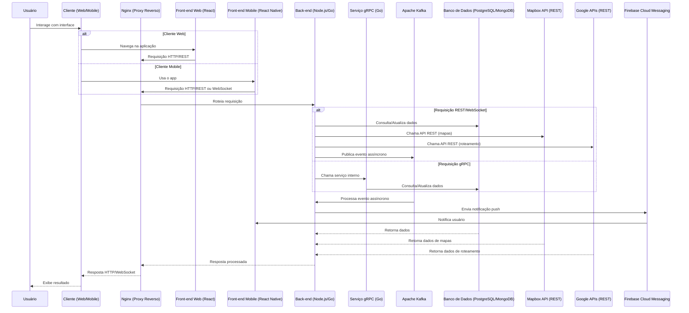

# Arquitetura da solução

<span style="color:red">Pré-requisitos: <a href="05-Projeto-interface.md"> Projeto de interface</a></span>

Definição de como o software é estruturado em termos dos componentes que fazem parte da solução e do ambiente de hospedagem da aplicação.


## Diagrama de classes

O diagrama de classes ilustra graficamente a estrutura do software e como cada uma das classes estará interligada. Essas classes servem de modelo para materializar os objetos que serão executados na memória.

* Ride Service  

* User service  

* Chat Service  

* Notification Service  


> **Links úteis**:
> - [Diagramas de classes - documentação da IBM](https://www.ibm.com/docs/pt-br/rational-soft-arch/9.7.0?topic=diagrams-class)
> - [O que é um diagrama de classe UML?](https://www.lucidchart.com/pages/pt/o-que-e-diagrama-de-classe-uml)

##  Modelo de dados

O desenvolvimento da solução proposta requer a existência de bases de dados que permitam realizar o cadastro de dados e os controles associados aos processos identificados, assim como suas recuperações.

Utilizando a notação do DER (Diagrama Entidade-Relacionamento), elabore um modelo, usando alguma ferramenta, que contemple todas as entidades e atributos associados às atividades dos processos identificados. Deve ser gerado um único DER que suporte todos os processos escolhidos, visando, assim, uma base de dados integrada. O modelo deve contemplar também o controle de acesso dos usuários (partes interessadas nos processos) de acordo com os papéis definidos nos modelos do processo de negócio.

Apresente o modelo de dados por meio de um modelo relacional que contemple todos os conceitos e atributos apresentados na modelagem dos processos.

### Modelo ER

O Modelo ER representa, por meio de um diagrama, como as entidades (coisas, objetos) se relacionam entre si na aplicação interativa.
* Ride Service  

* User Service  


* Chat Service  


* Notification Service  


> **Links úteis**:
> - [Como fazer um diagrama entidade relacionamento](https://www.lucidchart.com/pages/pt/como-fazer-um-diagrama-entidade-relacionamento)

### Esquema relacional

O Esquema Relacional corresponde à representação dos dados em tabelas juntamente com as restrições de integridade e chave primária.
 


---

> **Links úteis**:
> - [Criando um modelo relacional - documentação da IBM](https://www.ibm.com/docs/pt-br/cognos-analytics/12.0.0?topic=designer-creating-relational-model)

### Modelo físico

Insira aqui o script de criação das tabelas do banco de dados.

Veja um exemplo:

* Ride Service
```sql
--- V1__init_schema.sql
-- Tabela de usuários (Motoristas e Passageiros)
CREATE TABLE tb_users (
    id SERIAL PRIMARY KEY,
    name VARCHAR(255) NOT NULL,
    email VARCHAR(255) UNIQUE NOT NULL,
    username VARCHAR(255) UNIQUE NOT NULL,
    password VARCHAR(255) NOT NULL,
    created_at TIMESTAMP DEFAULT CURRENT_TIMESTAMP,
    updated_at TIMESTAMP DEFAULT CURRENT_TIMESTAMP
);

CREATE TABLE tb_role (
    id SERIAL PRIMARY KEY,
    name VARCHAR(255) NOT NULL,
    created_at TIMESTAMP DEFAULT CURRENT_TIMESTAMP,
    updated_at TIMESTAMP DEFAULT CURRENT_TIMESTAMP
);

CREATE TABLE tb_user_role (
    user_id INT REFERENCES tb_users(id) ON DELETE CASCADE,
    role_id INT REFERENCES tb_role(id) ON DELETE CASCADE,
    created_at TIMESTAMP DEFAULT CURRENT_TIMESTAMP,
    updated_at TIMESTAMP DEFAULT CURRENT_TIMESTAMP
);

-- Tabela de veículos
CREATE TABLE tb_vehicles (
    id SERIAL PRIMARY KEY,
    driver_id INT REFERENCES tb_users(id) ON DELETE CASCADE,  -- Referência ao motorista
    make VARCHAR(100) NOT NULL,
    model VARCHAR(100) NOT NULL,
    year INT NOT NULL,
    license_plate VARCHAR(20) NOT NULL UNIQUE,
    fuel_type VARCHAR(50),
    created_at TIMESTAMP DEFAULT CURRENT_TIMESTAMP,
    updated_at TIMESTAMP DEFAULT CURRENT_TIMESTAMP
);

-- Tabela de rotas sustentáveis
CREATE TABLE tb_sustainable_routes (
    id SERIAL PRIMARY KEY,
    start_point GEOGRAPHY(Point, 4326) NOT NULL,  -- Alterado para GEOGRAPHY
    end_point GEOGRAPHY(Point, 4326) NOT NULL,  -- Alterado para GEOGRAPHY
    distance DECIMAL(10,2) NOT NULL,  -- Distância em quilômetros
    estimated_time_ms INT NOT NULL,  -- Tempo estimado para a viagem
    co2_emission DECIMAL(10,2),  -- Emissão de CO2 estimada para a rota (em kg)
    created_at TIMESTAMP DEFAULT CURRENT_TIMESTAMP,
    updated_at TIMESTAMP DEFAULT CURRENT_TIMESTAMP
);

-- Tabela de corridas
CREATE TABLE tb_rides (
    id SERIAL PRIMARY KEY,
    driver_id INT REFERENCES tb_users(id) ON DELETE CASCADE,  -- Referência ao motorista
    vehicle_id INT REFERENCES tb_vehicles(id) ON DELETE SET NULL,  -- Referência ao veículo
    start_point GEOGRAPHY(Point, 4326) NOT NULL,  -- Alterado para GEOGRAPHY
    end_point GEOGRAPHY(Point, 4326) NOT NULL,  -- Alterado para GEOGRAPHY
    distance DECIMAL(10,2) NOT NULL,  -- Distância da corrida
    estimated_time_ms INT NOT NULL,
    co2_emission DECIMAL(10,2),  -- Emissão de CO2
    cost DECIMAL(10,2),  -- Custo da corrida
    sustainable_route_id INT REFERENCES tb_sustainable_routes(id) ON DELETE SET NULL,  -- Referência à rota sustentável
    created_at TIMESTAMP DEFAULT CURRENT_TIMESTAMP,
    updated_at TIMESTAMP DEFAULT CURRENT_TIMESTAMP
);

-- Tabela de pagamentos
CREATE TABLE tb_payments (
    id SERIAL PRIMARY KEY,
    user_id INT REFERENCES tb_users(id) ON DELETE CASCADE,  -- Referência ao usuário (passageiro)
    amount DECIMAL(10,2) NOT NULL,  -- Valor pago
    payment_method VARCHAR(50) NOT NULL,  -- Método de pagamento (ex: 'credit card', 'paypal')
    status VARCHAR(50) NOT NULL CHECK (status IN ('pending', 'completed', 'failed')),  -- Status do pagamento
    created_at TIMESTAMP DEFAULT CURRENT_TIMESTAMP,
    updated_at TIMESTAMP DEFAULT CURRENT_TIMESTAMP
);

-- Tabela intermediária para o relacionamento muitos para muitos entre corridas e pagamentos
CREATE TABLE tb_ride_payments (
    id SERIAL PRIMARY KEY,
    ride_id INT REFERENCES tb_rides(id) ON DELETE CASCADE,  -- Referência à corrida
    payment_id INT REFERENCES tb_payments(id) ON DELETE CASCADE,  -- Referência ao pagamento
    amount DECIMAL(10,2),  -- Valor pago (em caso de múltiplos passageiros)
    created_at TIMESTAMP DEFAULT CURRENT_TIMESTAMP
);

-- Tabela intermediária para o relacionamento muitos para muitos entre usuários (passageiros) e corridas
CREATE TABLE tb_ride_passengers (
    ride_id INT REFERENCES tb_rides(id) ON DELETE CASCADE,  -- Referência à corrida
    user_id INT REFERENCES tb_users(id) ON DELETE CASCADE,  -- Referência ao usuário (passageiro)
    created_at TIMESTAMP DEFAULT CURRENT_TIMESTAMP,
    start_point GEOGRAPHY(Point, 4326) NOT NULL,  -- Alterado para GEOGRAPHY
    end_point GEOGRAPHY(Point, 4326) NOT NULL,
    PRIMARY KEY (ride_id, user_id)
);

CREATE TABLE tb_driver_offers (
    id SERIAL PRIMARY KEY,
    driver_id INT NOT NULL REFERENCES tb_users(id) ON DELETE CASCADE,
    available_seats INT NOT NULL,
    origin GEOGRAPHY(Point, 4326) NOT NULL,  -- Alterado para GEOGRAPHY
    destination GEOGRAPHY(Point, 4326) NOT NULL,  -- Alterado para GEOGRAPHY
    available_datetime TIMESTAMP NOT NULL,
    ride_datetime TIMESTAMP NOT NULL,
    ride_id INT REFERENCES tb_rides(id) ON DELETE SET NULL,
    status VARCHAR(20) DEFAULT 'active'
);

CREATE TABLE tb_ride_requests (
    id SERIAL PRIMARY KEY,
    passenger_id INT NOT NULL REFERENCES tb_users(id) ON DELETE CASCADE,
    origin GEOGRAPHY(Point, 4326) NOT NULL,  -- Alterado para GEOGRAPHY
    destination GEOGRAPHY(Point, 4326) NOT NULL,  -- Alterado para GEOGRAPHY
    ride_datetime TIMESTAMP NOT NULL,
    drive_offer_id INT REFERENCES tb_driver_offers(id) ON DELETE SET NULL,
    status VARCHAR(20) DEFAULT 'pending'
);


--- V2__add_stop_points.sql
ALTER TABLE tb_rides ADD COLUMN stop_points GEOGRAPHY(MultiPoint, 4326) NOT NULL;

--- V3__remove_null_constraint
ALTER TABLE tb_rides ALTER COLUMN stop_points DROP NOT NULL;

--- V4__drop_unused_tables
-- Remover as constraints de chave estrangeira
ALTER TABLE tb_user_role DROP CONSTRAINT IF EXISTS tb_user_role_user_id_fkey;
ALTER TABLE tb_vehicles DROP CONSTRAINT IF EXISTS tb_vehicles_driver_id_fkey;
ALTER TABLE tb_payments DROP CONSTRAINT IF EXISTS tb_payments_user_id_fkey;
ALTER TABLE tb_ride_passengers DROP CONSTRAINT IF EXISTS tb_ride_passengers_user_id_fkey;
ALTER TABLE tb_driver_offers DROP CONSTRAINT IF EXISTS tb_driver_offers_driver_id_fkey;
ALTER TABLE tb_ride_requests DROP CONSTRAINT IF EXISTS tb_ride_requests_passenger_id_fkey;

-- Alterações na tabela tb_rides
ALTER TABLE tb_rides DROP COLUMN IF EXISTS sustainable_route_id;
ALTER TABLE tb_rides DROP COLUMN IF EXISTS driver_id;
ALTER TABLE tb_rides DROP COLUMN IF EXISTS vehicle_id;
ALTER TABLE tb_rides ADD COLUMN driver_id INT NOT NULL;
ALTER TABLE tb_rides ADD COLUMN vehicle_id INT NOT NULL;

-- Excluir tabelas dependentes
DROP TABLE IF EXISTS tb_user_role CASCADE;
DROP TABLE IF EXISTS tb_payments CASCADE;
DROP TABLE IF EXISTS tb_ride_payments CASCADE;
DROP TABLE IF EXISTS tb_sustainable_routes CASCADE;
DROP TABLE IF EXISTS tb_vehicles CASCADE;

-- Alterações na tabela tb_ride_passengers
ALTER TABLE tb_ride_passengers ALTER COLUMN user_id SET DATA TYPE INT;
ALTER TABLE tb_ride_passengers ALTER COLUMN user_id SET NOT NULL;
ALTER TABLE tb_ride_passengers ADD COLUMN role VARCHAR(255) NOT NULL CHECK(role IN ('passenger', 'driver'));


--- V5__drop_unused_tables
DROP TABLE IF EXISTS tb_users;
DROP TABLE IF EXISTS tb_role;

--- V6__change_user_id_type
ALTER TABLE tb_ride_passengers ALTER COLUMN user_id SET DATA TYPE VARCHAR(255);
ALTER TABLE tb_ride_requests ALTER COLUMN passenger_id SET DATA TYPE VARCHAR(255);
ALTER TABLE tb_rides ALTER COLUMN driver_id SET DATA TYPE VARCHAR(255);
ALTER TABLE tb_driver_offers ALTER COLUMN driver_id SET DATA TYPE VARCHAR(255);

--- V7__add_description_for_destinations
ALTER TABLE tb_rides ADD COLUMN description VARCHAR(255);
ALTER TABLE tb_ride_requests ADD COLUMN description VARCHAR(255);

--- V8__add_img_url
ALTER TABLE tb_rides ADD COLUMN img_url VARCHAR(255);
ALTER TABLE tb_ride_requests ADD COLUMN img_url VARCHAR(255);

--- V9__create_tb_vehicle
CREATE TABLE tb_vehicles (
    id SERIAL PRIMARY KEY,
    driver_id INT NOT NULL,
    make VARCHAR(100) NOT NULL,
    model VARCHAR(100) NOT NULL,
    year INT NOT NULL,
    license_plate VARCHAR(20) NOT NULL UNIQUE,
    fuel_type VARCHAR(50),
    created_at TIMESTAMP DEFAULT CURRENT_TIMESTAMP,
    updated_at TIMESTAMP DEFAULT CURRENT_TIMESTAMP
);

--- V10__add_vehicle_to_ride
ALTER TABLE tb_rides ADD constraint fk_vehicle FOREIGN KEY (vehicle_id) REFERENCES tb_vehicles(id);
```
* User Service
```sql

CREATE TABLE "User" (
  "id" text PRIMARY KEY NOT NULL,
  "name" text NOT NULL,
  "email" text,
  "password" text,
  "imgUrl" text,
  "numberOfFollowers" integer DEFAULT 0,
  "numberOfFollowings" integer NOT NULL DEFAULT 0,
  "username" text,
  "createdAt" timestamp(3) DEFAULT (CURRENT_TIMESTAMP),
  "isActive" boolean DEFAULT true,
  "authProvider" text DEFAULT ('local'::text)
);
CREATE TABLE "RefreshToken" (
  "id" text PRIMARY KEY NOT NULL,
  "token" text NOT NULL,
  "userId" text NOT NULL,
  "email" text NOT NULL,
  "revoked" boolean NOT NULL DEFAULT false
);

CREATE TABLE "PasswordRecovery" (
  "id" text PRIMARY KEY NOT NULL,
  "token" text NOT NULL,
  "userId" text NOT NULL,
  "email" text NOT NULL,
  "expiresAt" bigint NOT NULL,
  "revoked" boolean NOT NULL DEFAULT false
);
```
* Chat Service
```js
db.createCollection("chat", {
  validator: {
    $jsonSchema: {
      bsonType: "object",
      required: ["roomName", "members"],
      properties: {
        roomName: { bsonType: "string" },
        imgUrl: { bsonType: "string" },
        description: { bsonType: "string" },
        latestMessage: { bsonType: "string" },
        latestActivity: { bsonType: "date" },
        members: {
          bsonType: "array",
          items: {
            bsonType: "object",
            required: ["id", "name", "nickname"],
            properties: {
              id: { bsonType: "string" },
              name: { bsonType: "string" },
              nickname: { bsonType: "string" },
              imgUrl: { bsonType: "string" }
            }
          }
        }
      }
    }
  }
});

db.createCollection("message", {
  validator: {
    $jsonSchema: {
      bsonType: "object",
      required: ["sender", "content", "instant", "status", "chat"],
      properties: {
        sender: {
          bsonType: "object",
          required: ["id", "name", "nickname"],
          properties: {
            id: { bsonType: "string" },
            name: { bsonType: "string" },
            nickname: { bsonType: "string" },
            imgUrl: { bsonType: "string" }
          }
        },
        content: { bsonType: "string" },
        instant: { bsonType: "date" },
        status: { enum: ["RECEIVED", "SENT", "READ"] },
        chat: { bsonType: "objectId" }
      }
    }
  }
});

```
* Notification Service
```sql

--- Criação tabela tb_fcm_token
create table tb_fcm_token (
    user_id bigint not null,
    token varchar(255),
    primary key (user_id)
) engine = InnoDB;

--- Criação tabela tb_notification
create table tb_notification (
    created_at datetime(6),
    id bigint not null auto_increment,
    receiver_id bigint,
    sender_id bigint,
    message varchar(255),
    title varchar(255),
    primary key (id)
) engine = InnoDB;
```
Esse script deverá ser incluído em um arquivo .sql na pasta [de scripts SQL](../src/db).


## Tecnologias

Descreva qual(is) tecnologias você vai usar para resolver o seu problema, ou seja, implementar a sua solução. Liste todas as tecnologias envolvidas, linguagens a serem utilizadas, serviços web, frameworks, bibliotecas, IDEs de desenvolvimento, e ferramentas.

Apresente também uma figura explicando como as tecnologias estão relacionadas ou como uma interação do usuário com o sistema vai ser conduzida, por onde ela passa até retornar uma resposta ao usuário.


| Ambiente                 | Ferramenta/Serviço                        | Justificativa                                                                 |
|--------------------------|-------------------------------------------|-------------------------------------------------------------------------------|
| Linguagens de Programação | Go, TypeScript, Java                     | Uso conforme necessidade: Go, Java e TypeScript no back-end; TS no front-end |
| Mobile                   | React Native                              | Framework cross-platform para acelerar o desenvolvimento mobile              |
| Banco de Dados           | PostgreSQL + PostGIS, MongoDB             | PostGIS para geodados e consultas espaciais; Mongo para dados não-relacionais|
| Backend/API              | Node.js (TypeScript), Go, Java            | Modularidade e escolha por contexto da funcionalidade                        |
| Comunicação entre serviços| Apache Kafka, gRPC                       | Kafka para mensageria assíncrona e gRPC para comunicação performática direta |
| WebSockets               | Socket.IO ou ws                           | Comunicação em tempo real com o front-end                                    |
| API Testing              | Insomnia                                  | Testes e documentação de APIs                                                |
| Frontend Web             | -                                         | Projeto voltado ao mobile no momento                                         |
| Proxy Reverso            | Nginx                                     | Roteamento de requisições e balanceamento de carga                           |
| CI/CD                    | GitHub Actions                            | Automação de testes e deploys                                                |
| Versionamento            | Git + GitHub                              | Padrão de mercado e integração com board Scrum                               |
| Containerização          | Docker                                    | Isolamento de ambientes                                                      |
| Orquestração             | Kubernetes                                | Possível adoção para escalabilidade futura                                   |
| IDEs                     | VSCode, IntelliJ IDEA                     | Preferência pessoal e compatibilidade com múltiplas linguagens               |
| Notificações Mobile      | Firebase Cloud Messaging (FCM)            | Envio de push notifications para apps                                        |
| Mapas e Geodados         | Mapbox, Google Routes API                 | Visualização e roteamento geográfico no app                                  |
| Design de Arquitetura    | Eraser.io                                 | Ferramenta colaborativa para diagramas e esquemas                            |
| Infraestrutura           | AWS, Oracle Cloud, GCP ou Digital Ocean   | Adoção de serviços em nuvem gratuitos para ambiente de testes/desenvolvimento|
| Documentação             | Google Docs, Google Drive                 | Compartilhamento e versionamento leve de documentos                          |
| Comunicação              | WhatsApp                                  | Agilidade na comunicação entre membros da equipe                             |
| Gerenciamento de Projeto | GitHub Projects                           | Organização de tarefas com metodologia Scrum                                 |




## Hospedagem

A hospedagem e o lançamento da plataforma foram realizados utilizando uma infraestrutura em nuvem baseada em containers, com automação de deploy e monitoramento da qualidade de código.
### 🔧 Tecnologias e Estratégias Utilizadas:

*Orquestração com Kubernetes:* Toda a aplicação foi implantada em um cluster Kubernetes. Os recursos foram definidos utilizando arquivos Helm Charts, que facilitam a parametrização e o versionamento dos deployments.

**Docker:** Cada serviço da plataforma foi containerizado com Docker, garantindo portabilidade, isolamento e consistência entre ambientes.

**CI/CD com GitHub Actions:**

Automatização do processo de build, testes, análise de qualidade e deploy.

Utilização de Checkstyle para verificação da qualidade e padronização do código (Java).

As imagens Docker são construídas e publicadas em um registry privado (ou público), e posteriormente implantadas no cluster Kubernetes.

Helm: Utilizado para gerenciar os deployments Kubernetes com Helm Charts, garantindo reutilização, controle de versão e facilidade de gerenciamento dos serviços.

**Fluxo de Deploy:**

Desenvolvedor realiza o push para a branch principal.

Pipeline do GitHub Actions é acionada automaticamente:

Executa testes automatizados e análise de qualidade (ex: Checkstyle).

Realiza o build das imagens Docker.

Publica as imagens no repositório de contêineres.

Aplica os arquivos Helm no cluster Kubernetes para atualizar os serviços.

Aplicação é atualizada automaticamente no cluster e torna-se acessível ao usuário final.


> **Links úteis**:
> - [Website com GitHub Pages](https://pages.github.com/)
> - [Programação colaborativa com Repl.it](https://repl.it/)
> - [Getting started with Heroku](https://devcenter.heroku.com/start)
> - [Publicando seu site no Heroku](http://pythonclub.com.br/publicando-seu-hello-world-no-heroku.html)

## Qualidade de software

Conceituar qualidade é uma tarefa complexa, mas ela pode ser vista como um método gerencial que, por meio de procedimentos disseminados por toda a organização, busca garantir um produto final que satisfaça às expectativas dos stakeholders.

No contexto do desenvolvimento de software, qualidade pode ser entendida como um conjunto de características a serem atendidas, de modo que o produto de software atenda às necessidades de seus usuários. Entretanto, esse nível de satisfação nem sempre é alcançado de forma espontânea, devendo ser continuamente construído. Assim, a qualidade do produto depende fortemente do seu respectivo processo de desenvolvimento.

A norma internacional ISO/IEC 25010, que é uma atualização da ISO/IEC 9126, define oito características e 30 subcaracterísticas de qualidade para produtos de software. Com base nessas características e nas respectivas subcaracterísticas, identifique as subcaracterísticas que sua equipe utilizará como base para nortear o desenvolvimento do projeto de software, considerando alguns aspectos simples de qualidade. Justifique as subcaracterísticas escolhidas pelo time e elenque as métricas que permitirão à equipe avaliar os objetos de interesse.

> **Links úteis**:
> - [ISO/IEC 25010:2011 - Systems and Software Engineering — Systems and Software Quality Requirements and Evaluation (SQuaRE) — System and Software Quality Models](https://www.iso.org/standard/35733.html/)
> - [Análise sobre a ISO 9126 – NBR 13596](https://www.tiespecialistas.com.br/analise-sobre-iso-9126-nbr-13596/)
> - [Qualidade de software - Engenharia de Software](https://www.devmedia.com.br/qualidade-de-software-engenharia-de-software-29/18209)
